# Reddit-Scraper

The goal of this project is to retrieve some data related to a specific user in order to create statistics. 

# RETRIEVING DATA

The first step is retrieving a good amount of comments by an user.
The name of the subreddits in which the user has commented have been stored as well.
I used the Reddit PRAW library so the limit is 1000 comments.

# FILTERING DATA

All the comments have been filtered by removing stop-words(both with a library and a set of words written by myself), applying tokenization and lemmatization to each word.

# LABELING DATA

After obtaining enough comments it's time to label them. 
The library used here is the NLTK. 
    
    -1: Negative Comments
   
    0: Neutral Comments
    
    1: Positive Comments  
    
Labeling data is extremely useful to apply Sentiment Analysis on these comments in order to understand what connotation have the user's comments most of the time.

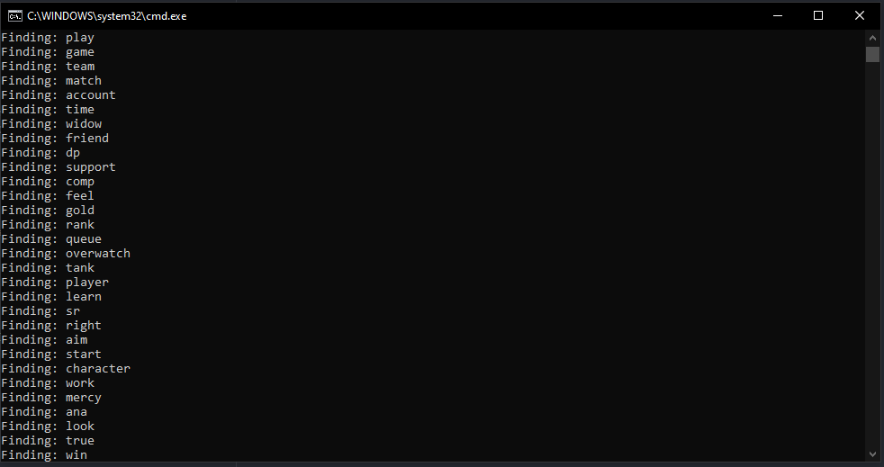

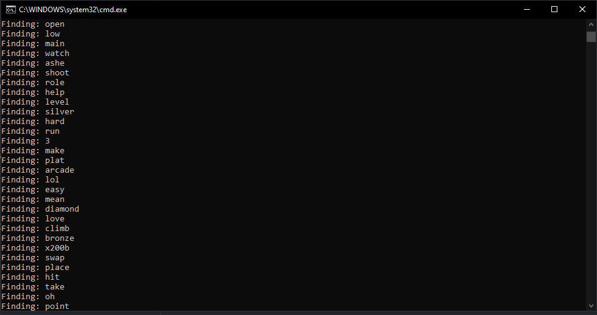

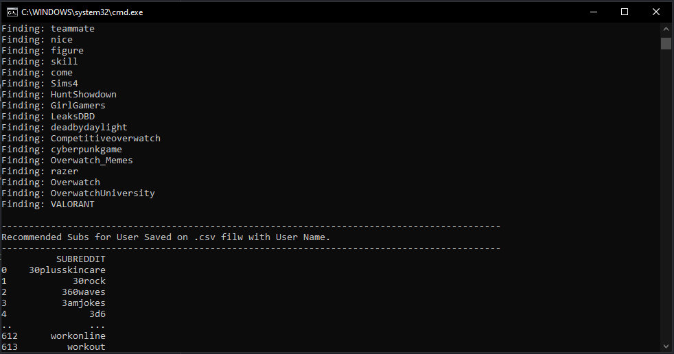

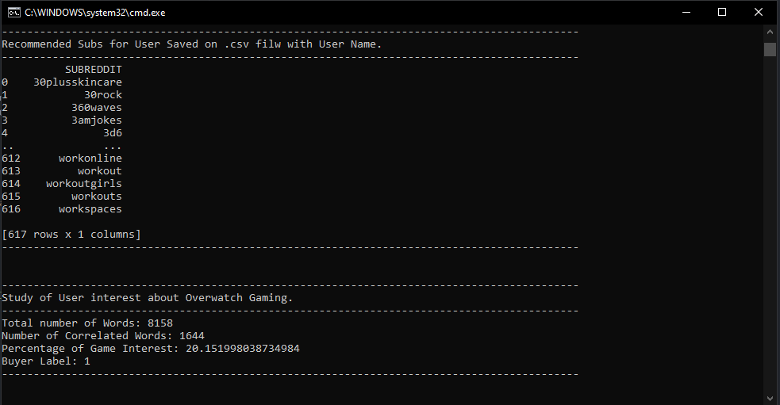

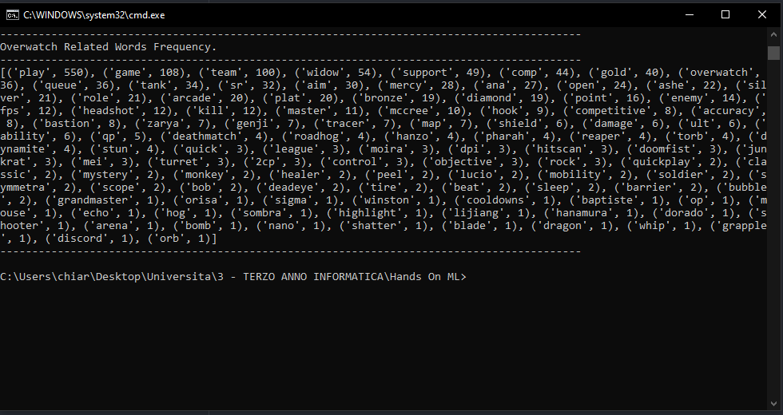

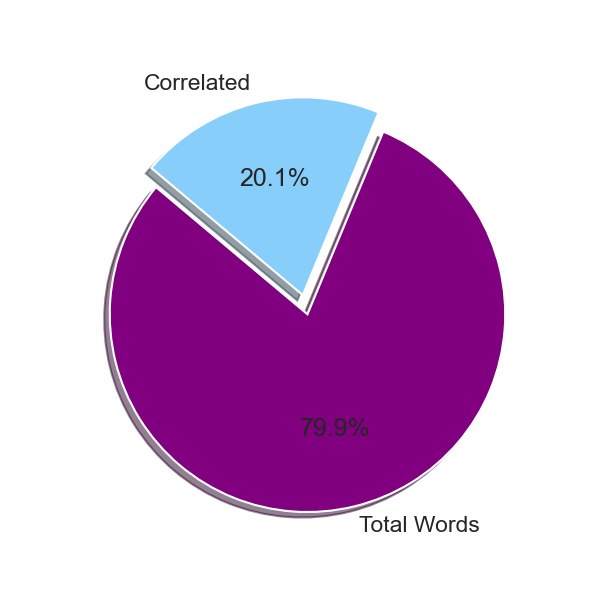

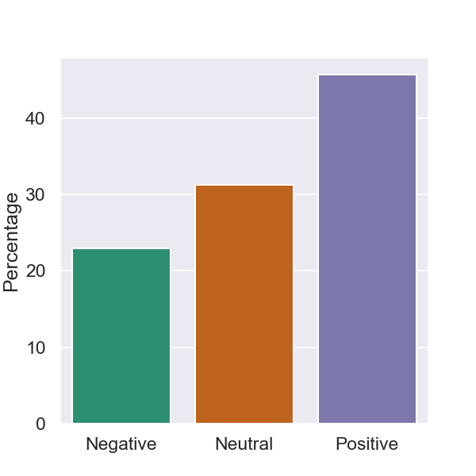

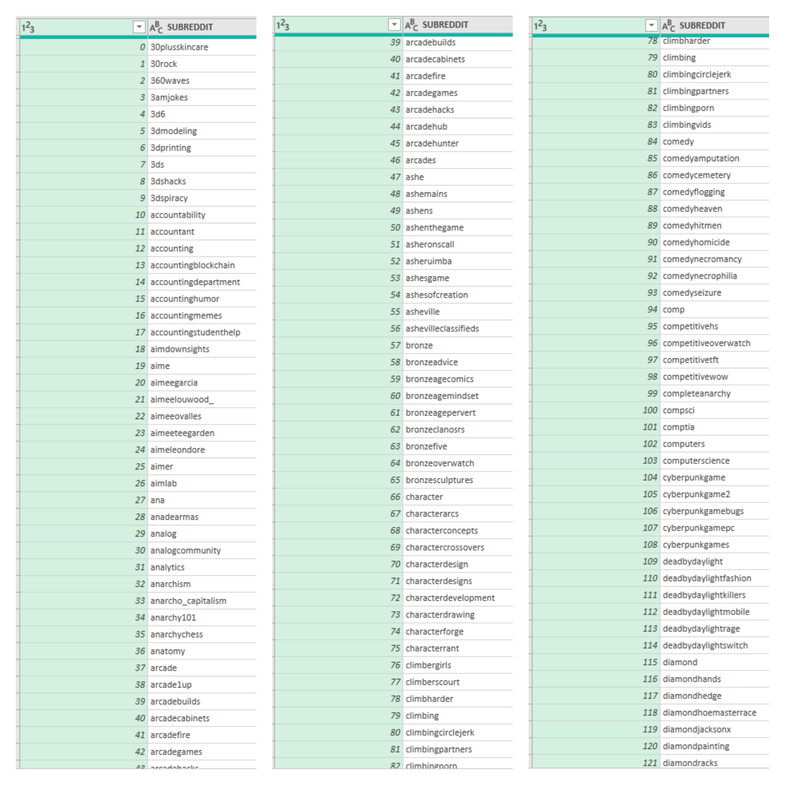

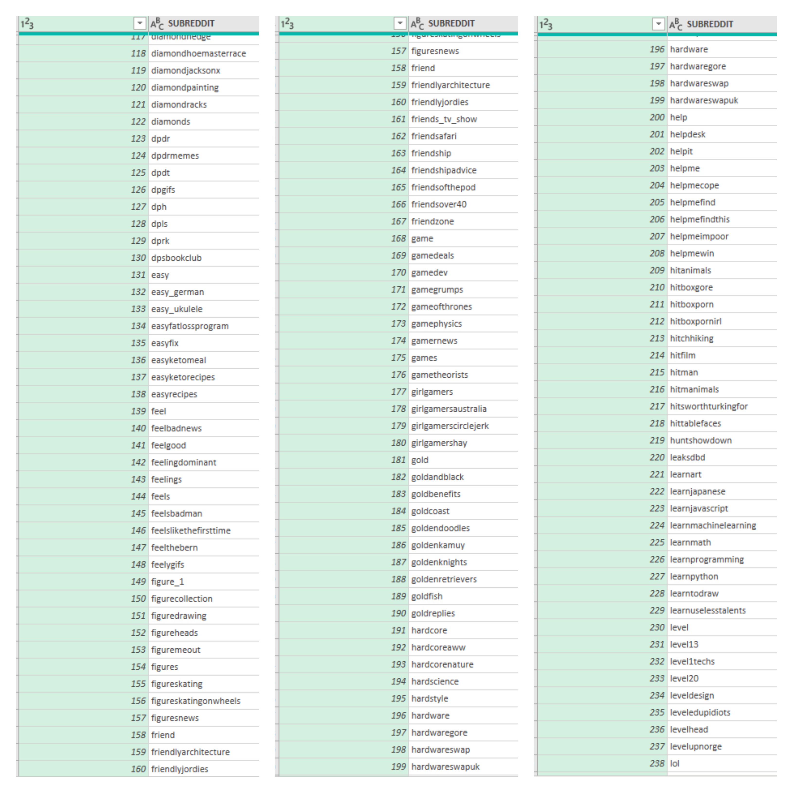

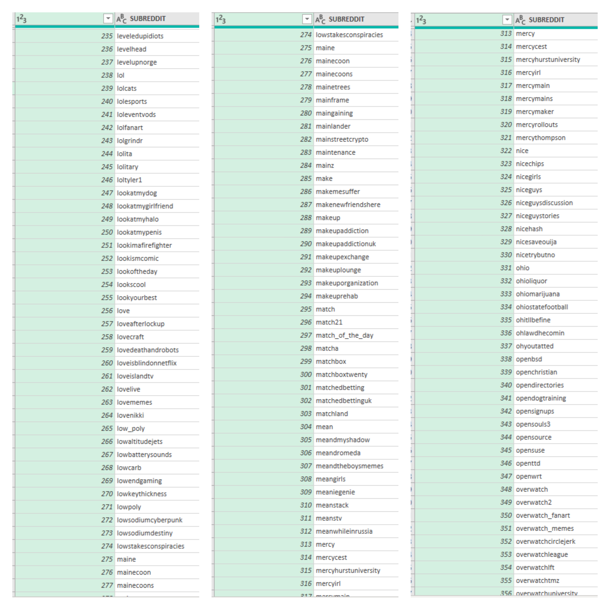

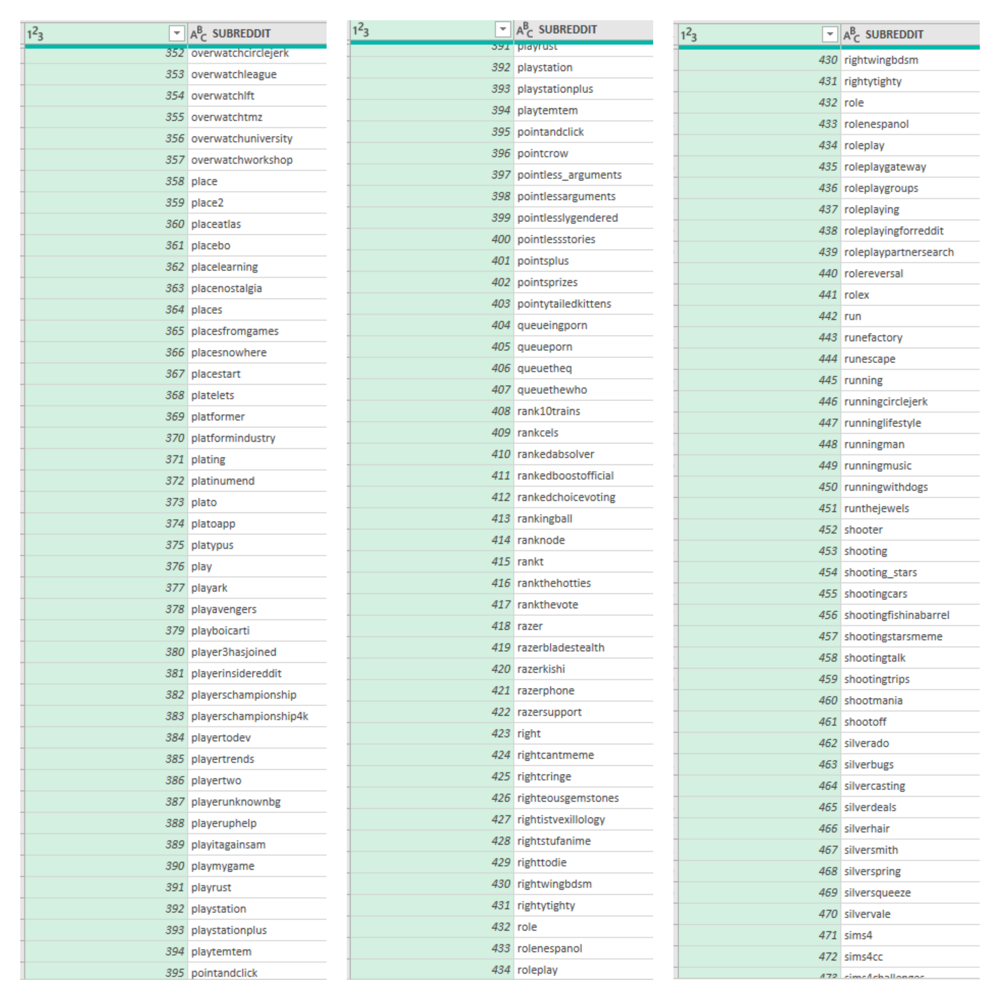

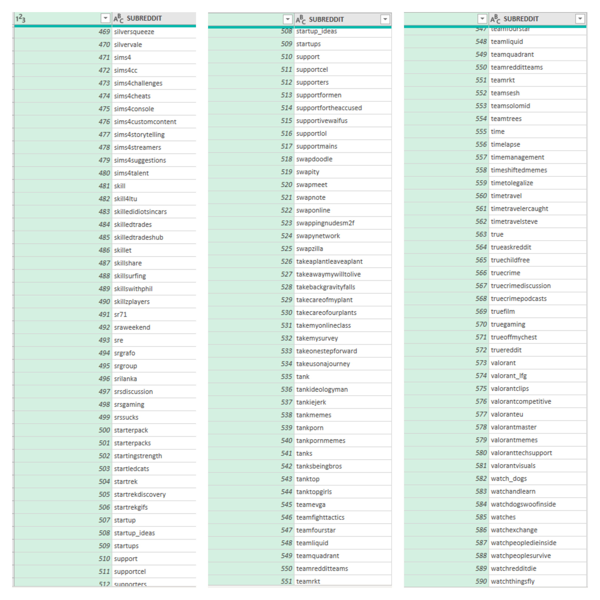
