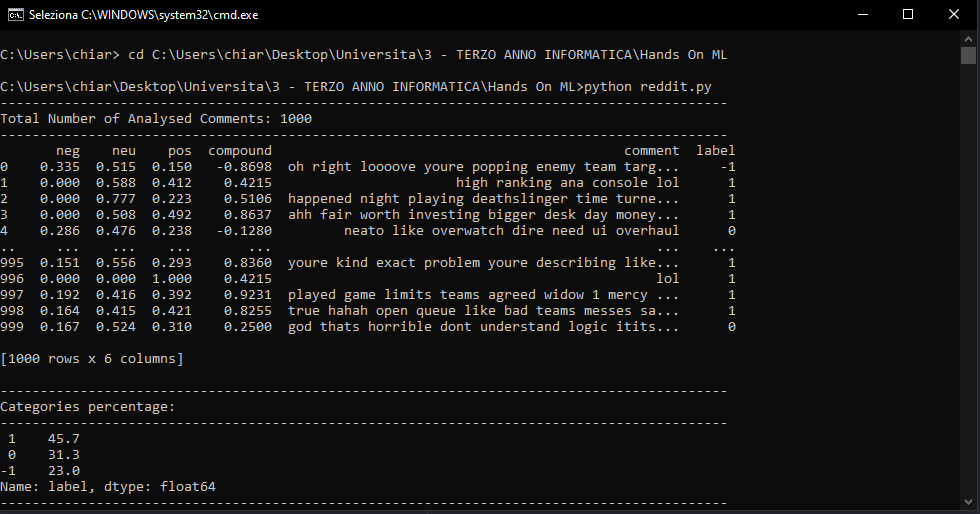

# Reddit-Scraper

The goal of this project is to retrieve some data related to a specific user in order to create statistics. 

# RETRIEVING DATA

The first step is retrieving a good amount of comments by an user.
The name of the subreddits in which the user has commented have been stored as well.
I used the Reddit PRAW library so the limit is 1000 comments.

# FILTERING DATA

All the comments have been filtered by removing stop-words(both with a library and a set of words written by myself), applying tokenization and lemmatization to each word.

# LABELING DATA

After obtaining enough comments it's time to label them. 
The library used here is the NLTK. 
    
    -1: Negative Comments
   
    0: Neutral Comments
    
    1: Positive Comments  
    
Labeling data is extremely useful to apply Sentiment Analysis on these comments in order to understand what connotation have the user's comments most of the time.

# LIST OF SUBREDDIT RECOMMENDATIONS

After labeling every comment I'm retrieving 100 of the most used positive words by the redditor.
These words are going to be used to generate a list of recommended subreddits that could potentially fit with the user's taste.
Another factor used to generate this list is the name of the subreddits in which the user is more active; useful to find similar subreddits.

# POTENTIAL BUYER?

Another study applied here is: Is this user a potential buyer for a certain product? (In this case a videogame called "Overwatch")
I've created a small set of words correlated to gaming and Overwatch.
Afterwards I've calculated what is the percentage of gaming/Overwatch correlated words in this user's pool of words. 
Is the percentage higher than a certain bound? If yes than this user is going to be considered as a possible buyer and his name is going to be added to a list.

